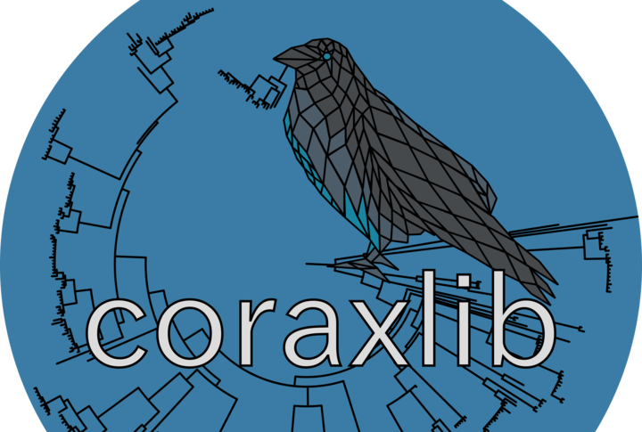

# coraxlib



`coraxlib` (COre RAXml LIBrary) encapsulates common routines used by likelihood-based
phylogenetic software such as [raxml-ng](https://github.com/amkozlov/raxml-ng). 
It will eventually supersede both [libpll-2](https://github.com/xflouris/libpll-2)
 and [pll-modules](https://github.com/ddarriba/pll-modules).

Please read the wiki for more information.

# Compilation instructions

Please make sure you have CMake 3.0.2 or later installed on your system.

Then, use following commands to clone and build `coraxlib`:

```bash
git clone https://codeberg.org/Exelixis-Lab/coraxlib.git
cd coraxlib
mkdir -p build && cd build
cmake ..
make
```

If you want to install `coraxlib` system-wide, please run:

```
sudo make install
```

The library will be installed on the operating system's standard paths.  For
some GNU/Linux distributions it might be necessary to add that standard path
(typically `/usr/local/lib`) to `/etc/ld.so.conf` and run `ldconfig`.

# Developing with coraxlib

Please see the docs [here](docs/libpll.md)

# coraxlib license and third party licenses

The coraxlib code is currently licensed under the
[GNU Affero General Public License version 3](http://www.gnu.org/licenses/agpl-3.0.en.html).
Please see LICENSE.txt for details.

coraxlib includes code from several other projects. We would like to thank the
authors for making their source code available.

coraxlib includes code from GNU Compiler Collection distributed under the GNU
General Public License.

# Registering and running tests

We use CTest for manageing our automated tests. You can thus use a standard CMake workflow:

```
cmake -B build
cmake --build build -j
pushd build && ctest; popd
```

We use Googletest for our unit tests.
To register a new unit-test, create a file in `test/unit/src` and add the following line to `test/unit/CMakeLists.txt`:

```
corax_register_test(test_my_awesome_new_test FILES src/my_awesome_new_test.cpp)
# or
corax_register_test(test_with_custom_defines FILES src/with_custom_defines.cpp DEFINES SAMPLE_DEFINE=1 ANOTHER_DEFINE=2)
```

# On Linear Algebra Libraries

The situation with linear algebra libraries is complicated. To build coraxlib in with non-reversible models enabled, the
following needs to be provided in some way:

- CBLAS (a C interface to BLAS)
- LAPACKE (a C interface to LAPACK)

Both of these packages normally depend on BLAS and LAPACK, respectively. Therefore, you will probably need to install
all four.

We recommend that users install OpenBLAS. Depending on the package manager, this will provide the interface to all of
the above. If this is not the case, then try installing CBLAS and LAPACKE, as these are the final targets required.
However, not all BLAS implementations are the same, strictly speaking. If you get linker errors, it is probably due to
the installed BLAS implementation not providing "extra" functions, which are present in OpenBLAS.
