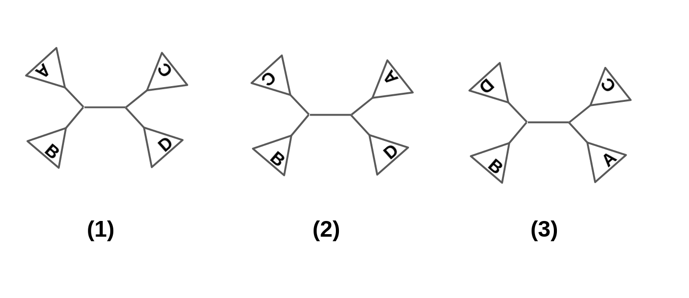
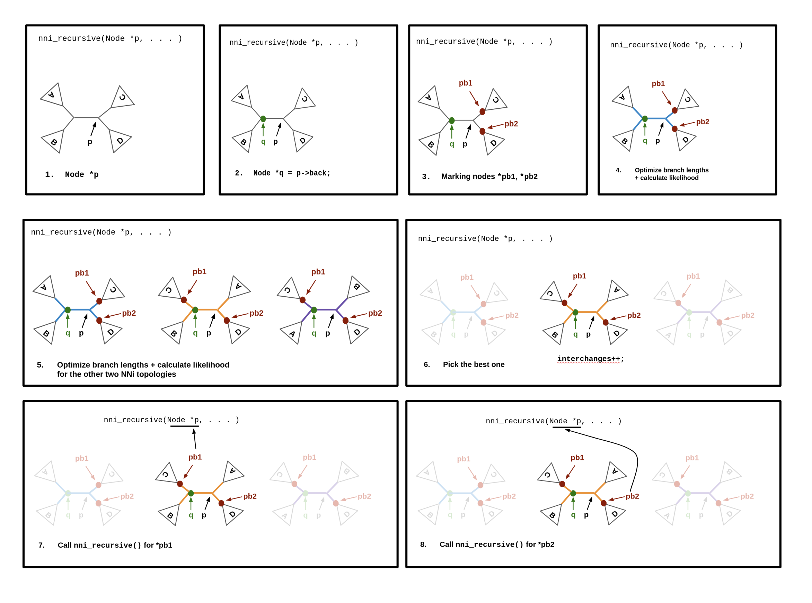
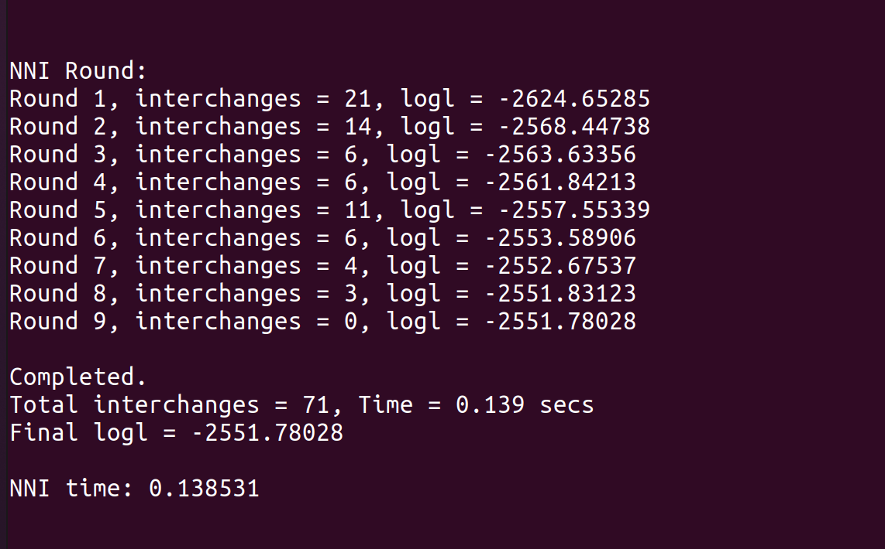

# Tutorial: How to run an NNI round on a tree.

## 1. Set up partition, tree and treeinfo structs

To use the NNI optimization functions, a properly initialized `corax_treeinfo_t` structure is required. There are several
methods to create this structure, but a quick start list is:

1. Create a `corax_partition_t`.
2. Create a `corax_utree_t` via either:
  - From an existing tree using `corax_utree_parse_newick()`,
  - Generate a random tree using `corax_utree_create_random()` (requires an MSA),
  - Generate a parsimony tree using `corax_utree_create_parsimony()` (requires an MSA).
3. Bind these structures together into a `corax_treeinfo_t`.

The `corax_treeinfo_t` struct will be used for the rest tutorial. More information can be found in steps 1-5 of 
[SPR tutorial](./spr_tutorial.md).

## 2. NNI moves - theoretical aspects

In this section, we are going to provide some theoretical aspects on Nearest-Neighbor-Interchange (NNI) moves, neighbors
and the search strategy that is implemented in Coraxlib. In case the user is already familiar with such topics, they can
skip the current section and move on to section 3.

Basically, NNI moves are defined around a central branch. The idea is the following: we pick one subtree that is derived
from one of the two vertices of the central branch and we interchange it with one of the two subtrees derived from the
second vertex of the central branch. For example, in the following figure, the leftmost topology (topology 1) is the
initial one. In topologies 2 and 3 we have switched the position of subtree A with subtrees C and D respectively. This
interchange is called an NNI-move. Topologies 2 and 3 are called NNI-neighbors of the initial topology. Moreover, it's
worth mentioning that topologies 1, 2 and 3 are the only three alternatives that can be constructed around a central
branch, given the subtrees A, B, C and D. If we take every single internal branch of the initial tree into account and
generate the three alternative topologies, we say that we have constructed the NNI-neighboorhood.



We now mention a few things about the heuristic strategy we use. Before reading this part, the user should be familiar
with how the general tree structure ( `corax_utree_t` ) is implemented in coraxlib, together with all the `next` and
`back` pointers. The user can read a few things about this topic [here](./corax_utree_t.md). 

Assuming, now, that the user is familiar with the tree structure, it is clear that every single branch of the tree can
be represented by a pair of subnodes ( `corax_unode_t` ) that are connected by `back` pointers. Actually, only one of
them is enough. We can use this observation to jump from one internal branch to another and take into account multiple
NNI-neighbors, so as to select the best of them.

The core of NNI optimization is a recursive function, called `nni_recursive()`, which is not available to the user, but
a sketch of the algorithm is shown below:

Sketch of `nni_recursive()`:
1. Start from the back node (Node `*q`) of a leaf (Node `*p`).
2. Mark nodes Node `*pb1 = p->next->back`, `*pb2 = p->next->next->back`.
3. Mark Node `*q = p->back` as the current root of the tree.
4. If Node `*q` is NOT a leaf:
    - For all three topologies which are NNI neighbors, optimize the branch lengths of the five branches that belong to
      the local quartet, calculate likelihoods and pick the best one.
5. If nodes `*pb1` and `*pb2` are not leaf nodes, repeat steps 2-4 for `*pb1` and `*pb2` recursively, else return.

Apart from step 3, which is a more technical one and is related with the update of Conditional Likelihood Vectors
(CLVs), the general idea of the algorithm is pretty simple. We start from a leaf branch (a branch that is adjacent to a
leaf node), move on to its exact next internal branch, examine the three NNI neighbors, pick up the one with the highest
likelihood score, and proceed recursively to the remaining internal branches. When `nni_recursive()` is terminated, we
say that an NNI round is completed. After its termination, we check how many interchanges were made throughout the NNI
round. Then, we call again `nni_recursive()` to move on to the second NNI round, and the whole process is repeated
roughly until zero interchanges are made within an NNI round. A summarization figure of the whole process is presented
below:



## 3. Perform an NNI round

Coraxlib offers two functions to the users: `corax_algo_nni_round()` and `corax_algo_nni_local()`. The first one is
performing a series of NNI rounds on the given tree and finds the so-called NNI optimal tree. The second one just
generates the two NNI-neighbors of the given tree around the branch of the root of the tree (which is assumed to be an
internal branch) and picks up the one with the highest likelihood score.

### 3.1. corax_algo_nni_local()

```
double corax_algo_nni_local(corax_treeinfo_t *treeinfo, /* pointer to treeinfo */
                            int    brlen_opt_method,    /* branch length optimization method */
                            double bl_min,              /* minimum branch length */
                            double bl_max,              /* maximum branch length */
                            int    smoothings,          /* number of branch-length optimization rounds */
                            double lh_epsilon)          /* NNI optimization threshold, e.g. 0.1 */
```

This function generates the two NNI neighbors around the branch corresponding to `treeinfo->root` node, and selects the
best of the three alternative topologies, meaning the one with the highest likelihood score. `lh_epsilon` parameter is
actually an optimization threshold, in order to avoid numerical issues, that tells the algorithm to accept an NNI move
only if the new topology has a likelihood score greater than `lh_epsilon` units of the score of the initial topology.
(Checks the condition `new_logl >= init_logl + lh_epsilon`).

The function returns either the likelihood of the best topology or a `CORAX_FAILURE` signal, in case something went wrong.

### 3.2. corax_algo_nni_round()

```
double corax_algo_nni_round(corax_treeinfo_t *treeinfo, /* pointer to treeinfo */
                            double tolerance,           /* NNI round threshold, e.g. 0.1 */
                            int    brlen_opt_method,    /* branch length optimization method */
                            double bl_min,              /* minimum branch length */
                            double bl_max,              /* maximum branch length */
                            int    smoothings,          /* number of branch-length optimization rounds */
                            double lh_epsilon,          /* NNI optimization threshold, e.g. 0.1 */
			     bool print_in_console)	  /* Default TRUE */
```

The function implements a series of NNI rounds and generates the NNI optimal tree. `tolerance` parameter is an
optimization threshold, in order to avoid numerical issues, that tells the algorithm to proceed to the next NNI round,
only if the score of the generated tree is greater by `tolerance` units than the score of the initial topology of the
current round. (Checks the condition `new_logl >= init_logl + tolerance` ). A second condition that leads to the
termination of the algorithm is when zero interchanges are counted throughout an NNI round.

The function returns either the likelihood of the NNI optimal tree or a `CORAX_FAILURE` signal, in case something went
wrong.

An example of the output of `corax_algo_nni_round()` to the console is shown in the following picture:




## 4. Calculate the SH-like aLRT support values

`corax_shSupport_values()` fucntion allows the users to calculate the SH-like aLRT values, that is, a statistical test to assess the support of the data for internal branches of a phylogeny. This statistical test was initially defined in [Guindon (2010)](https://academic.oup.com/sysbio/article/59/3/307/1702850?login=true). Since the statistical test is defined in NNI-optimal tree topologies, we recommend the user to run `corax_algo_nni_round()` first, otherwise, in case of a non-optimal topology, a warning message will be printed. Non NNI-optimal internal branches, as well as tip brances, will be assigned a `-inf` value. Ambiguous internal branches, that is, branches for which there is a second equally optimal NNI topology, will be assigned a zero value.

```
int corax_shSupport_values(corax_treeinfo_t *treeinfo,  /* pointer to treeinfo */
                            double tolerance,           /* NNI round threshold, e.g. 0.1 */
                            double *shSupportValues,    /* Array where the SH-aLRT statistics for each branch are stored */
                            int nBootstrap, 		/* Number of bootstrap replicates */
                            double shEpsilon, 	        /* Confidence value for the SH-aLRT metric calculation, e.g. 0.1 */
                            int    brlen_opt_method,    /* branch length optimization method */
                            double bl_min,              /* minimum branch length */
                            double bl_max,              /* maximum branch length */
                            int    smoothings,          /* number of branch-length optimization rounds */
                            double lh_epsilon,          /* NNI optimization threshold, e.g. 0.1 */
			     bool print_in_console)	  /* Default TRUE */
```

The function returns `CORAX_SUCCESS` in case the SH-aLRT values are calculated successfully. The values are stored in `*shSupportValues` array, which is passed as an argument in the function.

## 5. References

\[1] Guindon, S., Dufayard, J. F., Lefort, V., Anisimova, M., Hordijk, W., Gascuel, O. (2010). New Algorithms and Methods to Estimate Maximum-Likelihood Phylogenies: Assessing the Performance of PhyML 3.0. *Systematic Biology, 59*(3), 307–321. https://doi.org/10.1093/sysbio/syq010
