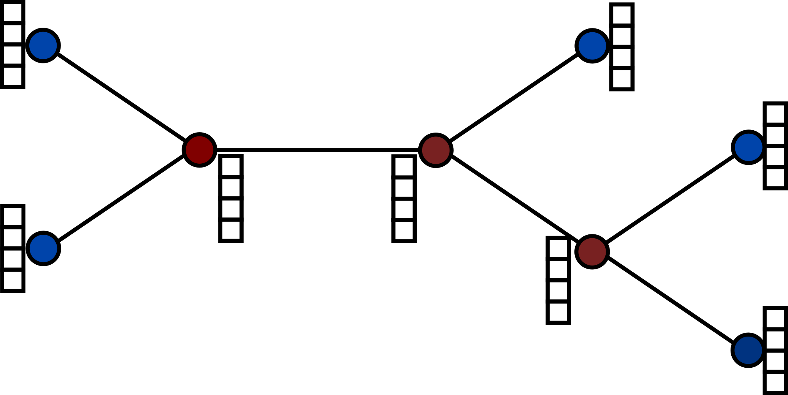
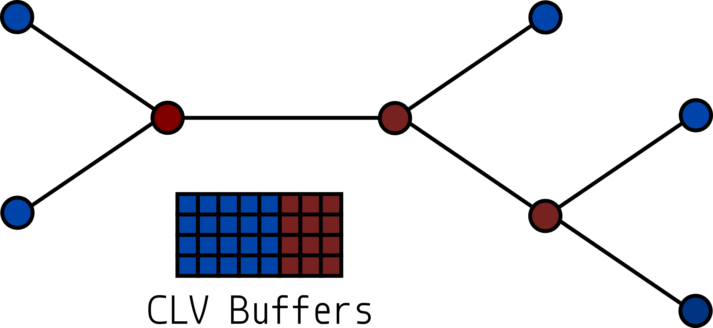
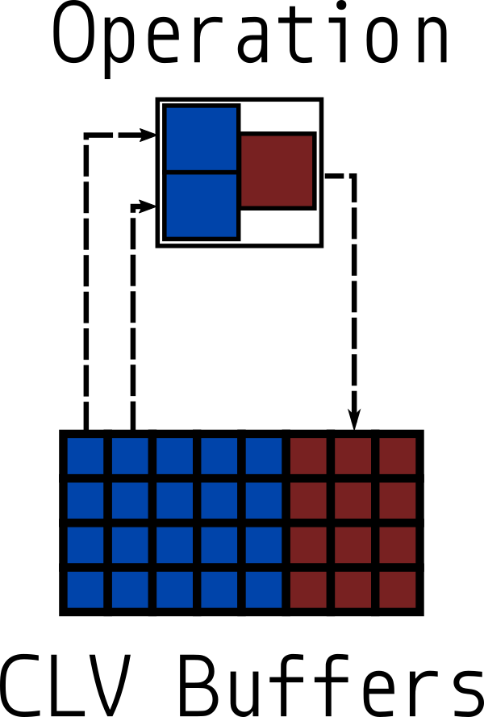
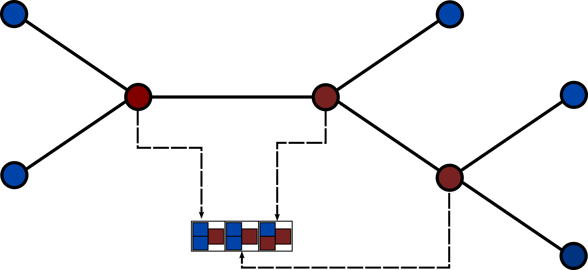

Scope
================================================================================

The goal of this documentation is to explain how to interact with `coraxlib`, as long as the reader already knows the
broad strokes of phylogenetic inference. As such, there will be some terms which are present in the text, but explaining
the terms completely is outside of the scope of this documentation.

This documentation is _not_ intended to teach phylogenetic inference, HPC, or programming in general. Basic knowledge of
these topics is assumed. Instead, this will explain how `coraxlib` does phylogenetic inference, not how it is done in
general.

High level design
================================================================================

At a high level, `coraxlib` exists to implement efficient versions of core functions that take up the majority of the
runtime during phylogenetic inference. To do this, `coraxlib` has a few important data structures which contain most of
the data required for likelihood computation:

- [`corax_utree_t`](corax_utree_t.md)
- [`corax_partition_t`](corax_partition_t.md)
- [`corax_operation_t`](corax_operation_t.md)

The `corax_utree_t` data structure contains the information that is relevant to the tree portion of the model, while
`corax_partitition_t` contains the other model parameters, as well as buffers to store intermediate values called
conditional likelihood vectors ([CLVs][clvs]), and information about the state of computation and the machine.

[clvs]: corax_partition_t.md#clv

For most use cases (especially those involving likelihood calculations) of `coraxlib`, both a `corax_utree_t` and a
`corax_partition_t` will be required. Information on how to create and interact with this data structures can be found
in their respective pages.

Likelihood Evaluation
================================================================================

`coraxlib` evaluates the likelihood of a tree using Felsenstein's Algorithm [^ref 1]. Conceptually, the algorithm is:

1. Pick a virtual root arbitrarily,
2. Perform a post order traversal from the virtual root. 
3. For each node in the traversal compute the current nodes CLV:
    - If a tip, simply return the assigned CLV
    - Otherwise, compute the CLV using the children's CLVs.

[^ref 1]: J. Felsenstein, “Evolutionary trees from DNA sequences: A maximum likelihood approach,” Journal of Molecular
Evolution, vol. 17, no. 6, pp. 368–376, Nov. 1981.

Implementation in `coraxlib`
--------------------------------------------------------------------------------



Suppose we want to calculate the likelihood of the tree shown in the above image.  As a visual aid, we have colored the
outer nodes blue and the inner nodes red.  Additionally, each node has been assigned a CLV buffer, where the results of
computation would be stored. This is approximately the method that would naively be used for the Felsenstein
algorithm[^1], and normally we could traverse the tree in a post-order fashion, using the method above, to compute a
likelihood.  But, we can do a bit better than this.

First, we plan on editing the tree, which might involve deleting old nodes and creating new nodes. Because we are
creating and deleting nodes, we would prefer to avoid the allocation and deallocation of large buffers[^2]. Fortunatly,
since the number of CLV buffers is constant for a given number of taxa, we can allocate the entire set of buffers in a
single allocation, and instead store in each node an index into this master buffer[^3]. The image below shows what this
might look like.



We have colored each CLV buffer according to each corresponding node's type, just for visual ease. Now, when we traverse
the tree, instead of using a local buffer to perform calculations, we instead look up the corresponding CLV in the main
CLV buffer using the node stored in each node, and use that for calculation. But, we can do better still. Tree
traversals can be rather expensive, as they involve a lot of pointer dereferences. These are difficult for CPU
prefetchers, which harms the cache efficiency, and at worst, this might really thrash the cache.

Given that we might traverse the tree many times (as is the case for rate matrix optimization), it would be nice to
memoize the traversal, and skip the dereferencing all together. To do this, we introduce the concept of an "operation".
An operation is just a representation of the work that needs to be done in order to compute a particular node's CLV.

An example operation can be seen in the figure below.



As we can see from the image, an operation just stores an index to 2 CLV indices for input, and one CLV index for
output[^4]. So, using these as building blocks, we can memoize the entire likelihood computation process, by simply
traversing the tree once, and then making operations for each computation required. An example traversal is shown in the
next image.



Here, we convert a post order traversal into an array of operations, which we can quickly iterate over to compute a new
likelihood[^5]. This is particularly useful for:

- Rate Matrix Optimization,
- Site Rate Optimization,
- or Global branch length optimization.

This is to say that any "global" parameter change will benefit from this representation of a tree traversal[^6]. So, when
`coraxlib` computes a likelihood for a tree, it 

1. Traverses the tree,
2. Makes Operations from the traversal,
3. Computes CLVs in the order of operations,
4. And finally, computes the likelihood via the "edge" or "root" method.

[^1]: We are skipping over the probability matrix portion of likelihood calculation, mostly because it is handled
analogously and just serves to complicated the matter here. Nonetheless, try to remember that each branch has a
probability matrix associated with it.

[^2]: Remember, a CLV is representative of a single site. In practice, we have many sites, and therefore many CLVs.

[^3]: In reality, since alignments have multiple (often many) sites, and each CLV buffer is per site, we choose to
allocate each individual node's CLV buffers in one block, and then have a buffer of buffers to address them all, but the
main concept here holds.

[^4]: There are also indices for the 2 probability matrices used to "evolve" the CLV along the 2 child branches.

[^5]: There is the final issue of turning CLVs _into_ likelihoods. There are 2 methods used in `coraxlib`, The first is
"root" and the second is "edge". In "root" likelihood computation, we simply take the dot product of the "root" CLV and
the base frequencies. For "edge" likelihood computation, 2 clvs associated with an edge are provided, and a matrix as
well. Then, the "edge" likelihood function simply combines the normal operations of "Matrix vector product" to produce
an "evolved" CLV, and the "root" computation.

[^6]: We achieve one more (theoretical) benefit from this procedure: we no longer need to (ostensibly) store CLV indices
in the node[^7]. Instead, the buffer for the node can be handed out in order of traversal, with the stipulation that CLVs
corresponding to outer nodes are first and "pinned". The big advantage is that less memory will be required to
compute the likelihood for a tree. Right now, this has been implemented in a version of `coraxlib`, but it currently does
not reside in the main branch.

[^7]: We still do, for purposes of saving computations for later use. Nonetheless, it can be useful to think of the clvs
being handed out like the nodes have no index for the purpose of this memory saver mode.

Core Tasks
================================================================================

In terms of calculations, `coraxlib` has optimized routines for 4 main tasks:

- Conditional Likelihood Vectors (CLVs)
- Derivatives
- Likelihood
- Probability Matrices (P-matrices)

In order to calculate the likelihood of a tree from scratch only Probability Matrices, CLVS, and Likelihood routines
are required. The Derivatives portion of calculation is used for optimization of the branch lengths of the tree.

A sample tree inference cycle might be:

1. Calculate Probability Matrices,
2. Calculate CLVs,
3. Calculate Likelihood,
4. Optimize Numeric Model Parameters/Branch Lengths,
5. Propose Change to Tree,
6. Optimize Numeric Model Parameters/Branch Lengths,
7. Repeat from 5 until done.

## CLVs

```
CORAX_EXPORT void corax_update_clvs(corax_partition_t * partition,
                                const corax_operation_t * operations,
                                unsigned int count);
```

This function will compute the CLVs in the nodes specified in the `operations`
array. This array is generated by [`corax_create_operations`][create_operations].

[create_operations]: corax_utree_t.md#Notable-Functions

## Derivatives

`coraxlib` has the capability to calculate first and second derivatives around a
single branch. To do this, first a sumtable needs to be computed. This can be
done with the function:

```
corax_export int corax_update_sumtable(corax_partition_t * partition,
                                      unsigned int parent_clv_index,
                                      unsigned int child_clv_index,
                                      int parent_scaler_index,
                                      int child_scaler_index,
                                      const unsigned int * params_indices,
                                      double *sumtable);
```

Notable Parameters:

- `parent_clv_index`, `child_clv_index`: The CLVs to the nodes representing the
  two endpoints of the branch in question.
- `param_indices`: A list of the indices for each rate category present in the
  partition.
- `sumtable`: Out parameter for the sumtable. Needs to be allocated with size
  `rates * states_padded`.

Once the sumtable is computed, we can use it to repeatedly call the derivatives
function. This evaluates the derivative of the model _at a point_. The intended
use case is to repeatedly evaluate first and second derivatives of one branch in
order to optimize it using [Newton-Raphson][nr].

[^nr]: https://en.wikipedia.org/wiki/Newton%27s_method

```
corax_export int corax_compute_likelihood_derivatives(corax_partition_t * partition,
                                                  int parent_scaler_index,
                                                  int child_scaler_index,
                                                  double branch_length,
                                                  const unsigned int * params_indices,
                                                  const double * sumtable,
                                                  double * d_f,
                                                  double * dd_f);
```

Notable Parameters:

- `branch_length`: branch length to evaluate the derivative at.
- `sumtable`: Sumtable from `corax_update_sumtable`.
- `d_f` : Out parameter which will contain the first derivative.
- `dd_f`: Out parameter which will contain the second derivative.


## Likelihood

There are two ways of computing a likelihood: around a root node, or around a
virtual root node. The difference is the number of CLVs involved. In a rooted
tree, the root CLV is basically finished. All that is required is to multiply
the CLV by the frequency, and compute the product.

In an unrooted tree, there is no single CLV that is nearly done, so we need to
compute it. So, in the case of an unrooted tree, an additional step is required
to make the final CLV.

Accordingly, there are two versions of the function to compute the likelihood of
the tree. The first is for trees with a root, and the second is for those
without.

Common arguments between the two functions:

- `partition`: The partition to calculate the likelihood on.
- `freq_indices`: An array of indices that is `sites` long.
- `persite_lnl`: If not null, then the per-site loglikelihoods are placed in
  this buffer.

```
CORAX_EXPORT double corax_compute_root_loglikelihood(corax_partition_t * partition,
                                                 unsigned int clv_index,
                                                 int scaler_index,
                                                 const unsigned int * freqs_indices,
                                                 double * persite_lnl);

CORAX_EXPORT double corax_compute_edge_loglikelihood(corax_partition_t * partition,
                                                 unsigned int parent_clv_index,
                                                 int parent_scaler_index,
                                                 unsigned int child_clv_index,
                                                 int child_scaler_index,
                                                 unsigned int matrix_index,
                                                 const unsigned int * freqs_indices,
                                                 double * persite_lnl);
```

The only meaningful difference between the arguments of these two functions is
whether they take 1 or 2 CLV/scalar indicies as arguments. In the case of root
logliklihood calculation, only one CLV is needed, so it takes one. In the case
of edge loglikelihood, we are calculating around and edge, so we need 2 CLVs,
and additionally a matrix index.

## Probability Matrix

To update the probability matrices of the `corax_partition_t`, a list of branch
lengths needs to be obtained. The best way to do this is with
[`corax_utree_create_operations`][notable_functions].


```
CORAX_EXPORT int corax_update_prob_matrices(corax_partition_t * partition,
                                        const unsigned int * params_index,
                                        const unsigned int * matrix_indices,
                                        const double * branch_lengths,
                                        unsigned int count);
```

- `matrix_indices`: A list of indices to put the matrices into.
- `branch_lengths`: A list of the branch lengths to use to produce the
  probability matrices. Each item in this list needs correspond to the same
  thing in the `matrix_indices` list, as this function will put the probability
  matrices in the location indicated by `matrix_indices`. The upshot of this is
  to just use [`corax_utree_create_operations`][notable_functions].
- `count`: The number of matrices to update.

[notable_functions]: corax_utree_t.md#Notable-Functions

## Misc

```
CORAX_EXPORT unsigned int * corax_compress_site_patterns(char ** sequence,
                                                     const corax_state_t * map,
                                                     int count,
                                                     int * length);
```

Compresses the MSA in place, i.e. the buffer `sequence` is changed to store the
compressed alignment.

- `sequence`: The alignment to compress, should be the one from `corax_msa_t`.
- `map`: Encoding map, ie `corax_map_nt`.
- `count`: number of sequences
- `length`: outparameter of the new length.

Data Structures
===============================================================================

Data structures have their own pages:

- [`corax_partition_t`](corax_partition_t.md)
- [`corax_utree_t`](corax_utree_t.md)

Errors
===============================================================================

Many functions which don't directly return a value instead return whether or
not the function was successful. In this case, the function was successful, then
`CORAX_SUCCESS` is returned. Otherwise, `CORAX_FAILURE` is returned. This value is
the same regardless of the error.

The _type_ of error is stored in `corax_errno`, and the message is stored in
`corax_errmsg`. `corax_errno` is an `int`, while `corax_errmsg` is a `char[200]`. Both
of these are present at the global scope.

Examples
===============================================================================

Some example programs are present in `examples/` and in `test/regression/src`. These cover the topics dicussed above, as
well as some additional tasks.
