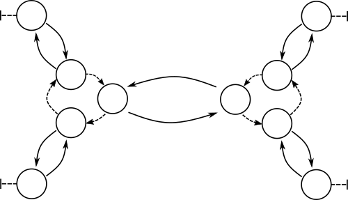

This will cover both the structures `corax_utree_t` and `corax_unode_t`, as well as the concepts and design around the
tree data structure in [`coraxlib`](coraxlib.md)

Concepts
================================================================================

Throughout this documentation, there is an important difference between the terms `corax_unode_t` and *node*. The former
refers to the actual data structure that is used to represent a vertex in a phylogenetic tree, while a *node* refers to
that actual vertex. Each node in a phylogenetic tree is made up of 1 or more `corax_unode_t`s. Typically, a leaf node
will be a single `corax_unode_t` with a `null` `next` pointer, and an inner node will be 3 `corax_unode_t`s.

Each `corax_unode_t` is a collection of two pointers and some associated data. The two pointers are the `next` and
`back` pointers. If a `corax_unode_t` is an inner node, then the `next` pointer points to the next `corax_unode_t` in
the node. If the `next` pointer is `null`, then that `corax_unode_t` represents a tip.

The `back` pointer represents edges. It points to a `corax_unode_t` associated with another node. Suppose that we have
the tree `((a,b),c,d)`, then the `coraxlib` representation of that would what is shown in the following figure.



Here, the dotted arcs indicate `next` pointers, and the solid lines represent `back` pointers. Please note that `back`
pointers are always mirrored, and that a mirrored pair of `back` pointers corresponds to a single edge in the tree.
Other values

Structures
================================================================================

The data structure is made up of two different structs. The first, `corax_utree_t` wraps the tree. In general, when a
tree is used for a function, it requires a `corax_utree_t`. Some important things to know about this structure: the last
`inner_count` nodes in the `nodes` array are assumed to be "inner nodes". This means that they have a non-null `next`
pointer. Several functions that use `corax_utree_t`s don't check for this, so they may fail when this assumption is
violated. To avoid this, use the `corax_utree_wraptree` function discussed below to create a `corax_utree_t`.

```
typedef struct corax_utree_s
{
  unsigned int tip_count;
  unsigned int inner_count;
  unsigned int edge_count;
  int binary;

  corax_unode_t ** nodes;
  corax_unode_t * vroot;
} corax_utree_t;
```

Fields:

- `tip_count`: Number of tips
- `inner_count`: number of inner nodes. Not the number of `corax_unode_t` that are
  part of inner nodes, but the number of interior nodes of a phylogenetic tree.
- `edge_count`: the number of edges in the tree.
- `nodes`: an array of pointers to nodes.
- `vroot`: A pointer to the virtual root. By convention, this is always an inner node.
  All tree manipulation functions such as `corax_utree_wraptree` obey to this convention.

----

It might be useful to look at the above figure when thinking about this
structure, since most of the complexity is in the behavior of the `next` and
`back` pointers.

```
typedef struct corax_unode_s
{
  char * label;
  double length;
  unsigned int node_index;
  unsigned int clv_index;
  int scaler_index;
  unsigned int pmatrix_index;
  struct corax_unode_s * next;
  struct corax_unode_s * back;

  void * data;
} corax_unode_t;
```

Fields:

- `label`: The label of the node. Optional.
- `length`: The length of the edge represented by the `back` pointer. This should be equal to `back->length`.
- `node_index`: Index of this node in the `nodes` buffer in a `corax_utree_t`. Each "super"-node shares an index. I.E.
  the index is on the "tree node" level, not on the `corax_unode_t` level.
- `clv_index`: Index of the CLVs to use when calculating a likelihood
- `scaler_index`: Index into the scaler array to represent the CLV scaler
- `pmatrix_index`: index into the array of probability matrices. These probability matrices need to be computed based on
  the length of the branch. Should be equal to `back->pmatrix_index`.
- `next`, `back`: See the explanation in the concepts section.
- `data`: An extra pointer to store "user data". In practice, this can be used
  for any task, but existing functions might also use it, so be careful.
